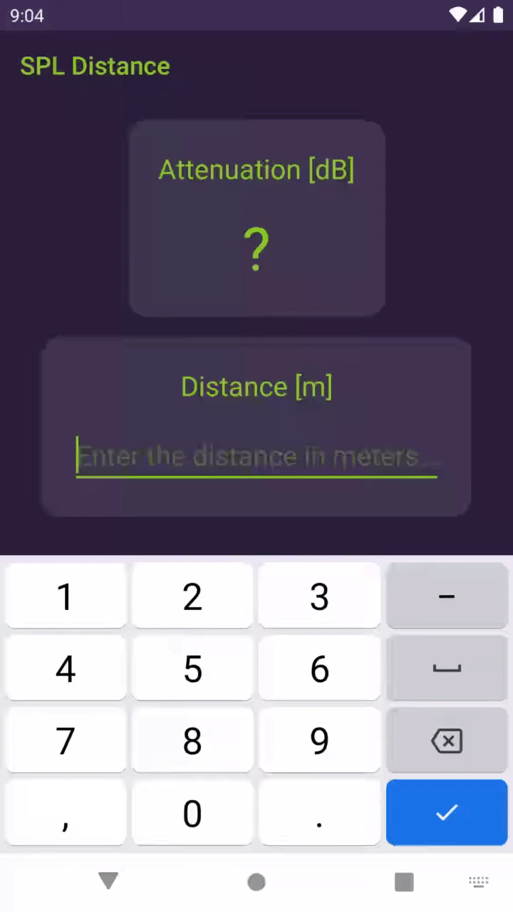

# SPL distance
This app calculates how many dB decreases the Sound Pressure Level (SPL)  depending on the distance.

Install it on [Google Play](https://play.google.com/store/apps/details?id=com.appacoustic.android.spldistance).

More info on [AppAcoustiC](http://appacoustic.com/).
